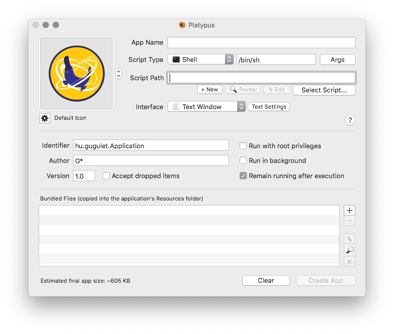
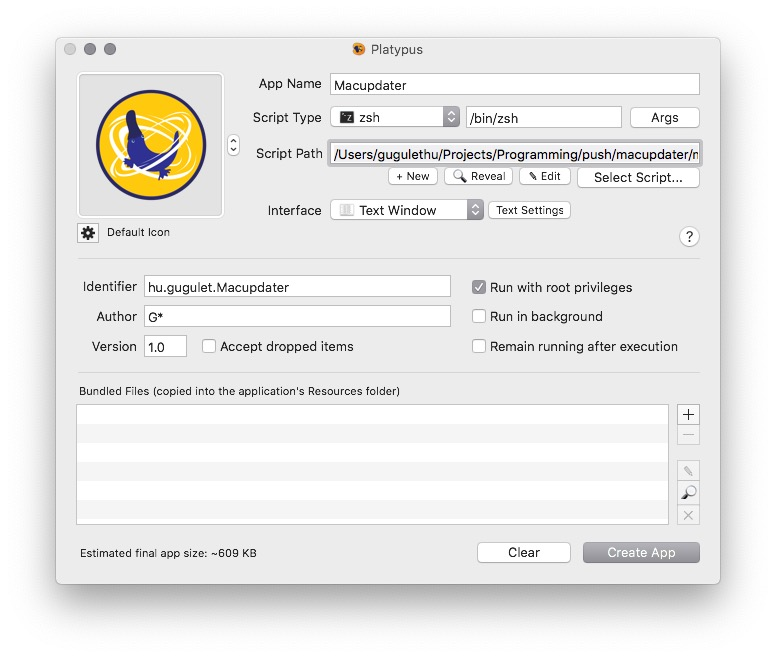

# Create app

## Download the Platypus app

You can download this app from the [**website**](https://sveinbjorn.org/platypus) or using brew.

```text
brew cask install platypus
```

## Import the script into the app

Click 'Select script...' after opening the app and select your shell script.



## Enable root privileges

In order for some updates to work you need to select 'Run with root privileges' and deselect 'Remain running after execution'. You may change other cosmetic options to suit your needs.



## Create app and run it to update

You may set the app to run at specific times or when certain actions take place using an application like **ControlPlane**. 

